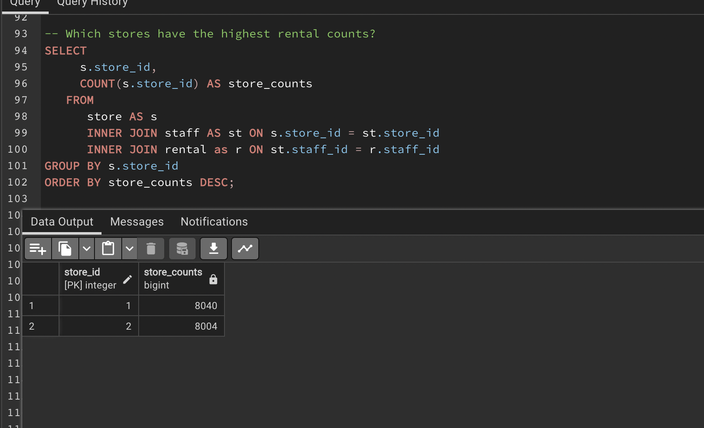

# DVD-Rental-Database-Project

## Introduction to DVD Rental Database Project
### Overview
This DVD Rental Database project aims to provide comprehensive insights into the operations of a fictional **DVD** rental business. This database includes various entities essential to the business operations, such as customers, films, rentals, payments, staff, and stores. By leveraging PostgresSQL, this project seeks to analyze and derive meaningful insights from the data, ultimately enhancing decision-making processes and business strategies.

### Objectives
The primary objectives of this project are:

1. **Data Exploration**: Understand the structure and relationships between different tables in the DVD rental database.
  
2. **Customer Insights**: Analyze customer behavior and preferences to identify key trends and patterns.

3. **Rental Patterns**: Examine rental activities to determine peak times, popular films, and rental durations.

4. **Financial Analysis**: Evaluate revenue streams and financial performance of the business.

5. **Store and Inventory Management**: Assess inventory levels and store performance to optimize operations.

6. **Staff Performance**: Measure staff productivity and efficiency.

### Database Schema
The DVD rental database consists of the following tables:

1. actor: Contains information about actors.
2. address: Stores addresses of customers and staff.
3. category: Defines the categories of films available for rent.
4. city: Stores city names.
5. country: Stores country names.
6. customer: Contains customer details.
7. film: Includes information about the films available for rent.
8. film_actor: Links films and actors, indicating which actors starred in which films.
9. film_category: Links films and categories, indicating the genre of each film.
10. inventory: Tracks the inventory of films in each store.
11. language: Specifies the languages in which films are available.
12. payment: Records payment transactions made by customers.
13. rental: Contains details of film rentals.
14. staff: Stores information about the staff members.
15. store: Contains details of the rental stores.

## Methodology
This project will employ PostgresSQL queries to extract and analyze data from the DVD rental database. By answering pertinent business questions, the analysis will provide actionable insights that can help improve customer satisfaction, optimize inventory management, enhance financial performance, and boost overall business efficiency.

## Analysis
**Customer Insights**:

1. Who are the top 10 customers by rental count?

2. Which customers have spent the most money on rentals?

3. Which customers have rented the most films in each category?

**Rental Patterns**
1. Which films are rented the most(TOP 10 films)?

2. What are the peak rental times (days/months)?
   
   **Days**
   

   **Months**
   

3. What is the average rental duration per film?

    

4. Which stores have the highest rental counts?

     

**Film Analysis**
1. Which actors are in the most rented films?

 

2. Which categories of films are rented the most?

  

3. What is the distribution of rental durations for different film categories?

   
   
   

**Financial Analysis**

1. What is the total revenue generated by rentals each month?

    

2. What is the average payment amount per rental?

   

**Store and Inventory Management**

1. How many copies of each film are available in each store?

      

      

2. What is the inventory turnover rate for each store?

    

**Staff Performance**

1. Which staff members process the most rentals?

   

2. Which staff members generate the most revenue through rentals?
   
    

3. What is the average processing time for rentals by each staff member?

    

## Conclusion;
- The 

## Thank you

   

   

   

